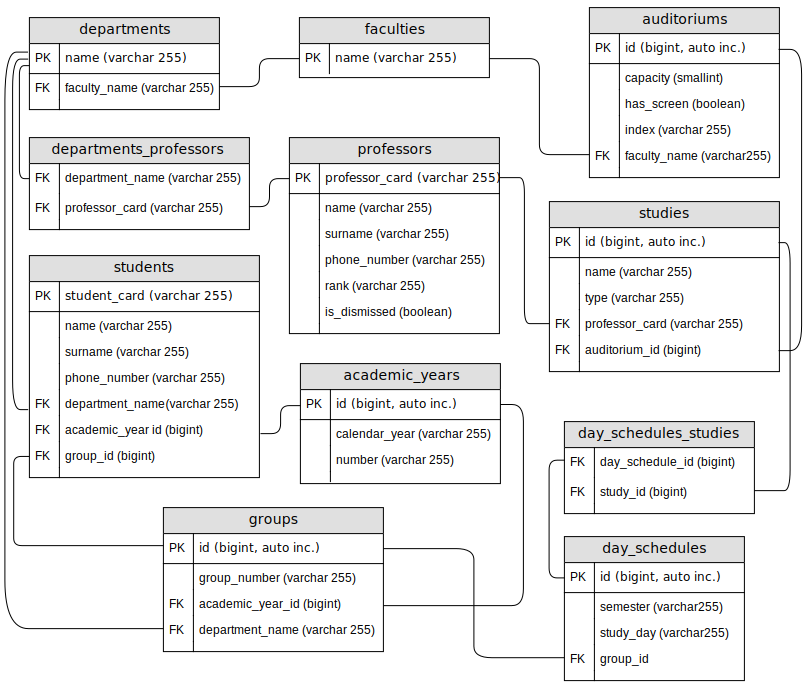

# University app

This app allows to maintain an university structure including faculties, departments, professors, students etc.
It utilizes such frameworks as Hibernate and Spring and is based on SOLID and REST architectural principles.
We can describe the university structure as shown below:<br> 
 

<br>
  
The structure and relations of entities used in this app to reperesent the university structure 
is shown on the following diagram:

### How to use

The app can be operated by using the following endpoints:

```GET: /academic-years/{id}``` — find academic year by id<br>
```GET: /academic-years?year=...&number=...``` — find academic year by calendar year and number<br>
```POST: /academic-years``` — add new academic year <br>
```PUT: /academic-years/{id}``` — update academic year with specified id<br>
```DELETE: /academic-years/{id}``` — delete academic year by id<br>

```GET: /auditoriums/{id}``` — find auditorium by id<br>
```GET: /auditoriums/by-faculty?name=...``` — get auditoriums by faculty<br>
```POST: /auditoriums``` — add new auditorium <br>
```PUT: /auditoriums/{id}``` — update auditorium with specified id<br>
```DELETE: /auditoriums/{id}``` — delete auditorium by id<br>

```GET: /schedules/{id}``` — find day schedule by id<br>
```GET: /schedules?id=...&semester=...&day=...``` — find day schedule by group id, semester and week day<br>
```POST: /schedules``` — add new day schedule <br>
```PUT: /schedules/{id}``` — update day schedule with specified id<br>
```DELETE: /schedules/{id}``` — delete day schedule by id<br>

```GET: /departments/{name}``` — find department by name<br>
```GET: /departments/by-faculty?name=...``` — get departments by faculty<br>
```POST: /departments``` — add new department <br>
```PUT: /departments``` — update department<br>
```DELETE: /departments/{name}``` — delete department by name<br>

```GET: /faculties/{name}``` — find faculty by name<br>
```GET: /faculties``` — get all faculties<br>
```POST: /faculties``` — add new faculty <br>
```PUT: /faculties``` — update faculty<br>
```DELETE: /faculties/{name}``` — delete faculty by name<br>

```GET: /groups/{id}``` — find group by id<br>
```GET: /groups/by-card?card=...``` — find group by student card<br>
```POST: /groups``` — add new group <br>
```PUT: /groups/{id}``` — update group with specified id<br>
```DELETE: /groups/{id}``` — delete group by id<br>

```GET: /professors/{card}``` — find professor by professor card<br>
```POST: /professors``` — add new professor <br>
```PUT: /professors``` — update professor<br>
```DELETE: /professors/{card}/dismiss``` — dismiss professor by professor card<br>
```DELETE: /professors/{card}/delete``` — delete professor by professor card<br>

```GET: /students/{card}``` — find student by student card<br>
```GET: /students``` — get all studying students<br>
```POST: /students``` — add new student <br>
```PUT: /students``` — update student<br>
```DELETE: /students/{card}/expel``` — expel student by student card<br>
```DELETE: /students/{card}/delete``` — delete student by student card<br>

```GET: /studies/{id}``` — find study by id<br>
```POST: /studies``` — add new study <br>
```PUT: /studies/{id}``` — update study with specified id<br>
```DELETE: /studies/{id}``` — delete study by id<br>

Also using the following endpoint you can get day schedule for specific student 
by student card for specified day of week:<br>
```GET: /schedules/by-card?card=...&day=...```
You can see the result on this screenshot:<br>


### Technologies used

* Java
* Hibernate
* Spring Data
* Spring Boot
* REST
* PostgreSQL
* Docker
* Maven
* JSON

### Important notes on how to start

First you should have PostgreSQL installed and configured. The database 'university' should be
created manually or using the following SQL script (you need to replace ```OWNER = 'YOUR_USERNAME'``` 
there with your DB owner name):

```resources/initDb.sql```

Edit the following fields in application.properties file to match your own:

```
your.username=YOUR_USERNAME
your.password=YOUR_PASSWORD
```

Initial data is injected automatically on start via SQL script. You can find it here:

```resources/data.sql```

# university-app
